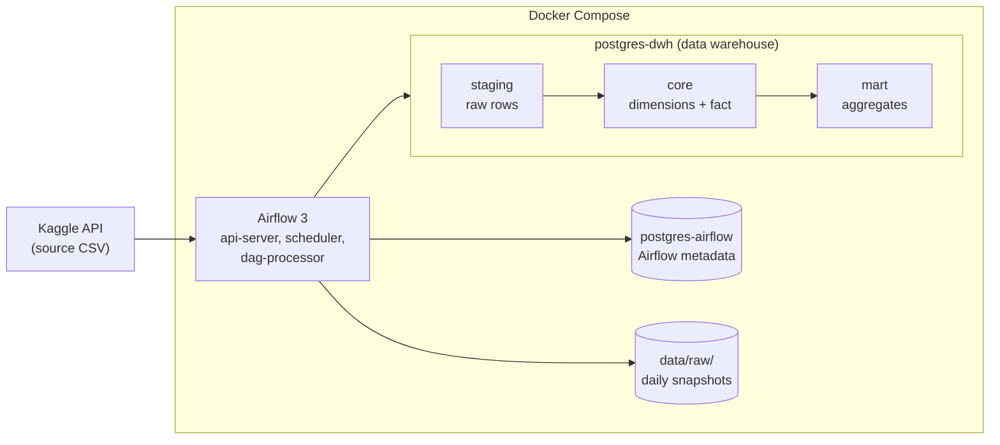
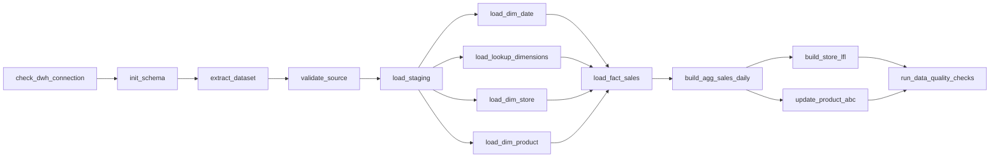
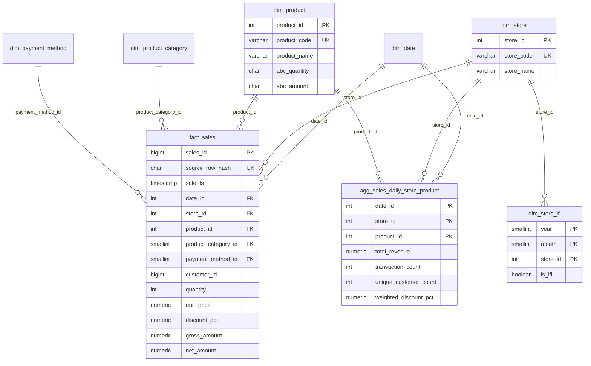

# Retail Sales Pipeline

A daily data pipeline for retail sales. It downloads the
[Retail Transaction Dataset](https://www.kaggle.com/datasets/fahadrehman07/retail-transaction-dataset)
from the Kaggle API, loads it into a PostgreSQL data warehouse, builds a
dimensional model (stores, products, sales) and calculates LFL and ABC
analytics. Apache Airflow 3 runs the pipeline every day at midnight.
Everything runs in Docker containers.

## Contents

1. [Task requirements and where to find them](#1-task-requirements-and-where-to-find-them)
2. [Quick start](#2-quick-start)
3. [Architecture](#3-architecture)
4. [The pipeline (DAG)](#4-the-pipeline-dag)
5. [Data profiling findings](#5-data-profiling-findings)
6. [Data model](#6-data-model)
7. [Business logic](#7-business-logic)
8. [Assumptions](#8-assumptions)
9. [Edge cases and error handling](#9-edge-cases-and-error-handling)
10. [Data quality checks](#10-data-quality-checks)
11. [Testing and code quality](#11-testing-and-code-quality)
12. [Technical decisions](#12-technical-decisions)
13. [Production considerations](#13-production-considerations)
14. [Known limitations](#14-known-limitations)
15. [Project structure](#15-project-structure)
16. [Troubleshooting](#16-troubleshooting)

---

## 1. Task requirements and where to find them

| Requirement | Where it is answered |
|---|---|
| Python, SQL, a database, Airflow, Docker Compose | Python in `src/`, SQL in `sql/`, PostgreSQL 16, Airflow 3.3.2, `docker-compose.yml` |
| Download the file from the Kaggle API with a job | Task `extract_dataset`, code in `src/retail_pipeline/extract.py` |
| Load sales data following naming, normalization and conventions | [Section 6](#6-data-model) |
| 1. Store dimension: unique stores, ID and random name | `core.dim_store`, [section 7.1](#71-stores-store-derivation) |
| 2. Product dimension: unique products, ID and random name | `core.dim_product`, [section 7.2](#72-products) |
| 3. LFL dimension: year, month, store ID, status | `core.dim_store_lfl`, [section 7.5](#75-lfl-like-for-like) |
| 4. Aggregation by day, store and product (revenue, transactions, unique customers, weighted discount %) | `mart.agg_sales_daily_store_product`, [section 7.4](#74-daily-aggregation) |
| 5. ABC analysis by quantity and by amount; new columns `abc_quantity` and `abc_amount` in the product dimension | `mart.v_product_abc` and `core.dim_product`, [section 7.6](#76-abc-analysis) |
| 6. Tasks in the orchestrator, run every day at 00:00 | DAG `retail_sales_pipeline`, [section 4](#4-the-pipeline-dag) |
| README: how to run, order of steps, special cases, business logic, technical decisions, deployment | This file |
| Production practices that are not done here | [Section 13](#13-production-considerations) |
| Use Git; do not commit the source data | `data/` and `*.csv` are in `.gitignore`; the file is downloaded at runtime |

---

## 2. Quick start

### Prerequisites

- Git
- Docker Desktop (or Docker Engine) with Docker Compose v2
- At least 4 GB of memory for Docker
- A Kaggle account and API credentials from kaggle.com, **Settings → API**.
  Depending on the account, Kaggle gives you either a `kaggle.json` file
  (with a username and a key) or an API token. Both work.
- Python 3.10 or newer, only for creating secrets and running tests locally

The commands below work in a terminal on macOS and Linux, and in Command
Prompt or PowerShell on Windows. Where Windows needs a different command,
it is shown separately.

### Step 1: Get the code

```bash
git clone https://github.com/Tsulukidze/retail-sales-pipeline.git
cd retail-sales-pipeline
```

All the following commands run in this folder.

### Step 2: Create the `.env` file

All settings and passwords are in a `.env` file. Git ignores it, so it
never ends up in the repository. Create it from the template:

```bash
cp .env.example .env         # macOS / Linux
copy .env.example .env       # Windows (Command Prompt and PowerShell)
```

### Step 3: Fill in `.env`

| Setting | What to write |
|---|---|
| `KAGGLE_USERNAME`, `KAGGLE_KEY` | The `username` and `key` values from `kaggle.json`, without quotes |
| `KAGGLE_API_TOKEN` | Only if Kaggle gave you an API token instead of `kaggle.json`. Then leave `KAGGLE_USERNAME` and `KAGGLE_KEY` empty. |
| `AIRFLOW_JWT_SECRET` | A random secret: `python -c "import secrets; print(secrets.token_urlsafe(32))"` |
| `AIRFLOW_FERNET_KEY` | An encryption key: `python -c "from cryptography.fernet import Fernet; print(Fernet.generate_key().decode())"` |
| `DWH_PASSWORD`, `AIRFLOW_DB_PASSWORD` | Passwords with **at least 5 characters**, for example from `python -c "import secrets; print(secrets.token_urlsafe(16))"` |
| `AIRFLOW_UID` | Linux only: the output of `id -u`. On macOS and Windows, keep `50000`. |

Notes:
- If `cryptography` is not installed, create the Fernet key inside the
  Airflow image: `docker run --rm apache/airflow:3.3.2 python -c "from cryptography.fernet import Fernet; print(Fernet.generate_key().decode())"`
- Airflow hides passwords in its logs only if they have 5 or more
  characters. Shorter passwords stay visible, and Airflow writes the warning
  "Skipping masking for a secret as it's too short".
- Passwords are part of connection URLs, so do not use `@ : / ? # %`.

### Step 4: Start the containers

```bash
docker compose up -d --build
```

The first start takes a few minutes, because Docker builds the Airflow
image. Check that all services are running and healthy:

```bash
docker compose ps
```

You should see five services with the status `healthy`. The one-time
container `airflow-init` is not in the list after it has finished; that is
normal.

### Step 5: Open Airflow

Open <http://localhost:8080> and log in with `AIRFLOW_ADMIN_USER` and
`AIRFLOW_ADMIN_PASSWORD` from `.env`.

### Step 6: Run the pipeline

The DAG `retail_sales_pipeline` is paused when it is created. Unpause it
with the toggle, then click **Trigger** to run it now. Without a manual
trigger, it runs every day at 00:00 (Tbilisi time).

A full run takes about one minute. All 14 tasks should become green.

### Step 7: Look at the results

Connect any SQL client (DataGrip, DBeaver, psql) to the warehouse:

| Setting | Value |
|---|---|
| Host | `localhost` |
| Port | `DWH_PORT` from `.env` (default `5433`) |
| Database | `DWH_DB` (default `retail_dwh`) |
| User / password | `DWH_USER` / `DWH_PASSWORD` |

In DataGrip, also select the schemas `staging`, `core` and `mart` in the
data source settings (tab **Schemas**), otherwise only `public` is shown.

Some queries to start with:

```sql
-- All tables and views with their descriptions
SELECT table_schema, table_name,
       obj_description(format('%I.%I', table_schema, table_name)::regclass) AS description
FROM information_schema.tables
WHERE table_schema IN ('staging', 'core', 'mart')
ORDER BY 1, 2;

-- Stores and products with their generated names and ABC classes
SELECT * FROM core.dim_store ORDER BY store_id;
SELECT * FROM core.dim_product ORDER BY product_id;

-- ABC analysis with shares and cumulative percentages
SELECT * FROM mart.v_product_abc ORDER BY amount_cumulative_pct;

-- LFL status per month, with the reason
SELECT month,
       COUNT(*) AS stores,
       COUNT(*) FILTER (WHERE is_lfl) AS lfl_stores,
       MAX(days_required_current) AS days_required_this_year,
       MAX(days_worked_prior) AS max_days_worked_last_year,
       MAX(days_required_prior) AS days_required_last_year
FROM core.dim_store_lfl
GROUP BY month
ORDER BY month;
```

### Step 8 (optional): Run the manual logic checks

Two SQL scripts prove that the LFL and ABC logic is correct, with made-up
data where the right answer is known (see [section 11](#11-testing-and-code-quality)).
Run each file **as a whole** (in DataGrip: *Execute Script*), never a
selected part:

- `sql/manual_checks/check_lfl_logic.sql`: expected result `18 of 18 checks OK`
- `sql/manual_checks/check_abc_logic.sql`: expected result `12 of 12 checks OK`

Both scripts end with `ROLLBACK`, so they do not change any real data.

### Stopping and resetting

```bash
docker compose down        # stop the containers, keep the data
docker compose down -v     # stop and delete all database data (full reset)
```

To rebuild only the warehouse (and keep Airflow's users and run history),
run this SQL and then trigger the DAG:

```sql
DROP SCHEMA staging, core, mart CASCADE;
```

The pipeline creates all tables again and loads everything from the Kaggle
file. Stores and products get the same IDs and the same names as before.

---

## 3. Architecture



### Containers

| Service | What it does |
|---|---|
| `postgres-dwh` | The data warehouse. Port 5433 is open, so you can query it from your computer. |
| `postgres-airflow` | Airflow's own database (DAG runs, task states). No open port: only Airflow uses it. |
| `airflow-init` | Runs once at start: prepares Airflow's database and creates the admin user. |
| `airflow-apiserver` | The Airflow web UI and API, on port 8080. |
| `airflow-scheduler` | Starts the DAG on schedule and runs the tasks (LocalExecutor). |
| `airflow-dag-processor` | Reads the DAG files. |

All Airflow containers use one image: the official `apache/airflow:3.3.2`
image plus the packages in `requirements.txt` (`docker/airflow.Dockerfile`).

### Warehouse layers

| Schema | What it holds | How it is loaded |
|---|---|---|
| `staging` | The source rows with correct data types, plus load information | Emptied and loaded again on every run |
| `core` | The dimensional model: dimensions, the fact table, the LFL table, the LFL view | Dimensions and fact: only new rows are added. LFL: rebuilt every run. |
| `mart` | The daily aggregation table and the ABC view | Rebuilt every run |

### Where the logic lives

- `dags/` only defines the tasks and their order. It contains no business logic.
- `src/retail_pipeline/` contains all Python logic. It does **not** import
  Airflow, so it can be tested without Airflow.
- `sql/` contains all SQL: table definitions (`ddl/`), transformations
  (`transform/`), data quality checks (`checks/`) and manual logic checks
  (`manual_checks/`).

---

## 4. The pipeline (DAG)

The DAG is called `retail_sales_pipeline`.

| Setting | Value | Why |
|---|---|---|
| Schedule | `0 0 * * *`, timezone Asia/Tbilisi | The task asks for a daily run at midnight |
| `catchup` | `False` | When the DAG is turned on, it does not try to run all missed days since the start date |
| `max_active_runs` | `1` | Two runs at the same time could fight over the same tables |
| `execution_timeout` | 30 minutes per task | A task that hangs is stopped instead of blocking the pipeline |
| Retries | 3 retries, only for `extract_dataset` | See below |



| # | Task | What it does | Code |
|---|---|---|---|
| 1 | `check_dwh_connection` | Stops early if the warehouse cannot be reached | DAG |
| 2 | `init_schema` | Creates the schemas, tables and views if they do not exist | `sql/ddl/*.sql` |
| 3 | `extract_dataset` | Downloads the dataset from the Kaggle API into `data/raw/YYYY-MM-DD/` | `extract.py` |
| 4 | `validate_source` | Checks the file: it exists, has all columns, has rows | `validation.py` |
| 5 | `load_staging` | Converts every row to the right types and loads all rows into staging | `parsing.py`, `staging_loader.py` |
| 6 | `load_dimensions` (4 tasks, in parallel) | Adds new dates, categories, payment methods, stores and products | `sql/transform/`, `dimensions.py`, `names.py` |
| 7 | `load_fact_sales` | Adds new sales to the fact table | `sql/transform/load_fact_sales.sql` |
| 8 | `build_agg_sales_daily` | Rebuilds the daily aggregation table | `sql/transform/build_agg_sales_daily.sql` |
| 9 | `build_store_lfl` | Rebuilds the LFL table | `sql/transform/build_store_lfl.sql`, `sql/ddl/050_core_views.sql` |
| 10 | `update_product_abc` | Updates the ABC classes of products | `sql/transform/update_product_abc.sql`, `sql/ddl/060_mart_views.sql` |
| 11 | `run_data_quality_checks` | Runs 12 checks; the task fails if any check fails | `sql/checks/data_quality_checks.sql`, `quality.py` |

**Retries only for the download.** A network or Kaggle problem is often
temporary, so trying again helps. In the other tasks, an error usually means
a bug or bad data, and trying again would only waste time.

**Safe to run again.** Every task gives the same result if it runs twice.
Running the DAG twice on the same day does not create duplicates. This is
tested: the second run of the full DAG gives exactly the same tables.

**What the logs show.** Most tasks print a short result, for example:
`Loaded 100,000 rows into staging`, the number of new fact rows, the ABC
classes per product, and the full data quality report.

---

## 5. Data profiling findings

Before designing the model, I profiled the source file with pandas. The
findings decided several design choices.

| Finding | Number | Effect on the design |
|---|---|---|
| Rows, columns | 100,000 rows, 10 columns | Small data: one machine and full rebuilds are fine |
| Missing values, duplicate rows | none, none | Strict loading is possible: one bad row stops the load |
| Date format | always `MM/DD/YYYY HH:MM` | One fixed format; anything else is an error |
| Date range | 29 Apr 2023 to 28 Apr 2024 | LFL can find no store with a full month last year (see 7.5) |
| `TotalAmount` | equals `Price × Quantity × (1 − Discount / 100)` in 100% of rows | `TotalAmount` is revenue after discount |
| Distinct `StoreLocation` | 100,000: **every row has a different address** | The address cannot be the store (see 7.1) |
| Distinct state codes in the addresses | 62, about 1,500 sales each | The state code is used as the store |
| Distinct products | 4 (A, B, C, D), each about 25% of sales | ABC has almost no differences (see 7.6) |
| Categories per product | every product appears in all 4 categories | Category belongs to the sale, not to the product |
| Distinct customers | 95,215, about 1.05 purchases each | Customer has only an ID: no customer table |
| Payment methods | 4 | Small lookup table |

---

## 6. Data model



### Tables

| Table | One row per | Keys |
|---|---|---|
| `staging.stg_retail_transactions` | row in the source file | none (emptied every run) |
| `core.dim_date` | calendar day | `date_id` (e.g. `20240131`) |
| `core.dim_store` | store (state code) | `store_id` (surrogate), `store_code` (business key, unique) |
| `core.dim_product` | product | `product_id` (surrogate), `product_code` (business key, unique) |
| `core.dim_product_category` | category | `product_category_id`, name unique |
| `core.dim_payment_method` | payment method | `payment_method_id`, name unique |
| `core.fact_sales` | sale (one source row) | `sales_id` (surrogate), `source_row_hash` (unique) |
| `core.dim_store_lfl` | store and month of the current year | (`year`, `month`, `store_id`) |
| `mart.agg_sales_daily_store_product` | day, store and product with sales | (`date_id`, `store_id`, `product_id`) |
| `core.v_store_lfl` (view) | store and month | the LFL calculation |
| `mart.v_product_abc` (view) | product | the ABC calculation |

The tables and views also have descriptions in the database
(`COMMENT ON TABLE`), so they are visible in any SQL client.

### Modeling decisions

- **Star schema.** One fact table with sales, and dimension tables around
  it. This is the standard model for analytics: simple to query and fast.
- **Two keys in every dimension.** A surrogate key (`store_id`), created by
  the warehouse and used for joins, and the business key from the source
  (`store_code`), used to find the right row when new data arrives. If the
  source ever changed its codes, only the mapping would change, not every
  foreign key.
- **Category and payment method are separate small tables.** They are
  attributes of the sale, and the task asks for normalization. Two tiny
  tables remove repeated text from 100,000 fact rows.
- **No customer table.** The source has only the customer ID, nothing else.
  A table with one column would add a join and no information. So
  `customer_id` stays in the fact table (a "degenerate dimension"). It is
  needed to count unique customers.
- **A calendar table (`dim_date`)** with full years. It is used for date keys
  and the month and year of each sale.
- **Rules in the database.** Primary keys, unique keys, foreign keys,
  `NOT NULL` and `CHECK` rules (quantity > 0, discount between 0 and 100,
  ABC class is A, B or C) protect the data, whatever code writes it.

### Naming conventions

| Rule | Example |
|---|---|
| `snake_case`, singular table names | `dim_store`, not `DimStores` |
| Prefix shows the table type | `stg_`, `dim_`, `fact_`, `agg_`, `v_` (view) |
| `_id` = surrogate key, `_code` = business key from the source | `store_id`, `store_code` |
| `is_` = boolean | `is_lfl`, `is_weekend` |
| `_at` = timestamp of a technical event, `_ts` = business timestamp | `loaded_at`, `sale_ts` |
| `_pct` = percentage (0 to 100) | `discount_pct` |
| DDL files are numbered to set their order | `001_schemas.sql`, `010_staging.sql`, ... |

---

## 7. Business logic

### 7.1 Stores (store derivation)

**Problem:** the source has no store ID. The only store information is
`StoreLocation`, a full address, and this address is different in every one
of the 100,000 rows. If every address were a store, there would be 100,000
stores with one sale each. That makes the dimension and LFL meaningless.

**Decision:** the store is the **state code** from the address. Example:

```
StoreLocation: '910 Mendez Ville Suite 909\nPort Lauraland, MO 99563'
store_code:    'MO'
```

This gives 62 stores with about 1,500 sales each. The codes include
Washington DC, US territories and military post codes (AA, AE, AP); they are
kept as stores. The rule is in one function, `derive_store_code()` in
`src/retail_pipeline/parsing.py`, so a different store definition would be
a small change.

**Store names:** the task asks for a random name per store. A random name
must still **not change** between runs. So the name generator (Faker) is
seeded with a number calculated from the store code: the same code always
gets the same name, for example `MO` → "West Anthony Center". Details:

- The number comes from SHA-256 of the code. Python's built-in `hash()` is
  not used, because it gives a different result every time Python starts.
- Names are created only when a new store is added. Existing names are
  never changed.
- The Faker version is fixed in `requirements.txt`, because a newer version
  could create different names.

### 7.2 Products

Products are the distinct `ProductID` values: A, B, C and D. Names are
created in the same stable way as store names, for example `A` → "Gray
Backpack". New products are added automatically; IDs follow the code order
(A = 1, B = 2, ...).

### 7.3 Sales (fact table)

- One row per sale. The source has no transaction ID, so each sale is
  identified by `source_row_hash`: an MD5 hash of the original text of the
  row.
- `gross_amount` = `unit_price × quantity` (before discount).
  `net_amount` = the source `TotalAmount` (after discount).
- Only new sales are added (matched by `source_row_hash`). A second run adds
  0 rows.
- If a sale cannot be matched to a store, product, category or payment
  method, the load **fails** with a clear error. It does not silently drop
  the sale (this would make all totals too low).

### 7.4 Daily aggregation

Table `mart.agg_sales_daily_store_product`, one row per day, store and
product with sales.

| Column | Meaning | Formula |
|---|---|---|
| `total_revenue` | revenue after discount | `SUM(net_amount)` |
| `total_gross_amount` | revenue before discount | `SUM(gross_amount)` |
| `total_quantity` | units sold | `SUM(quantity)` |
| `transaction_count` | number of sales | `COUNT(*)` |
| `unique_customer_count` | different customers | `COUNT(DISTINCT customer_id)` |
| `weighted_discount_pct` | average discount, weighted by sales value | `SUM(gross_amount × discount_pct) / SUM(gross_amount)` |

**Weighted discount, example:** 10% off a sale of 1,000 and 20% off a sale
of 100. The simple average is 15%. The weighted discount is
(1,000 × 10 + 100 × 20) / 1,100 = **10.9%**, because the big sale counts
more. I checked the formula with a second one, `(1 − net / gross) × 100`;
both give the same result.

Notes:
- `total_gross_amount` is stored so the weighted discount can be calculated
  correctly for bigger groups later (per week, per store, ...).
- **Do not add up `unique_customer_count`** across days, stores or products:
  the same customer would be counted more than once.
- The table has 59,629 rows for 100,000 sales. There are 90,768 possible
  combinations (366 days × 62 stores × 4 products). Sales are spread
  randomly, so about one third of the combinations have no sales.

### 7.5 LFL (like-for-like)

**The rule (from the task):** a store is LFL in a month if it had sales on
every required day, in this year **and** in the same month of last year.

| Item | How it is calculated |
|---|---|
| Current year | the year of the last sale in the data (2024) |
| Months | January to the month of the last sale (January to April 2024) |
| Days required this year | all days of the month; for the month of the last sale ("current month"), only the days up to the last sale date |
| Days required last year | all days of the same month |
| Days worked | number of different days with at least one sale |
| Status | `is_lfl = true` if days worked = days required, in both years |

Details:
- Every store gets a row for every month, also stores without sales.
- Nothing is hard-coded: the current year and month come from the data.
- The days required are calculated from the calendar, not by counting rows
  in `dim_date`. If last year were missing in `dim_date`, counting would
  give 0 days required, and every store would wrongly become LFL.
- Leap years are handled: February 2024 needs 29 days, February 2023 needs 28.
- `is_lfl` is a boolean. The task's example uses 1/0, which is `is_lfl::int`.
- The rule is written in one place, the view `core.v_store_lfl`. The task
  copies its result into `core.dim_store_lfl`.

**Result with this data: every store has `is_lfl = false`.** This is the
correct result, not an error. The data starts on 29 April 2023, so no store
can have a full month in 2023:

| Month (2024) | Days required in 2024 | Days required in 2023 | Days with data in 2023 |
|---|---|---|---|
| January | 31 | 31 | 0 |
| February | 29 | 28 | 0 |
| March | 31 | 31 | 0 |
| April (current month) | 28 (data ends 28 April) | 30 | 2 (29 and 30 April) |

To make this visible, the LFL table has four **explanation columns**:
`days_worked_current`, `days_required_current`, `days_worked_prior` and
`days_required_prior`. Every status shows its own reason.

**Proof that the logic works:** because the real data cannot show an LFL
store, `sql/manual_checks/check_lfl_logic.sql` creates two years of made-up
sales for six test stores and compares the view with the expected answers:

| Test store | Situation | Expected |
|---|---|---|
| T1 | sales every day in both years | LFL in every month |
| T2 | no sales on 10 Feb 2023 | not LFL in February |
| T3 | no sales on 5 Mar 2024 (current month) | not LFL in March |
| T4 | new store, no sales in 2023 | never LFL |
| T5 | no sales at all | never LFL |
| T6 | no sales on 29 Feb 2024 (leap day) | not LFL in February |

Result: 18 of 18 checks correct.

### 7.6 ABC analysis

**The rule (from the task),** done separately for quantity and for amount:

1. Total per product, from the daily aggregation table.
2. Sort the products from the biggest total to the smallest.
3. Share % = product total / total of all products × 100.
4. Cumulative % = the share of this product + the shares of all products above it.
5. Class: **A** if cumulative % ≤ 50, **B** if ≤ 70, **C** above 70.

The classes are written to `core.dim_product` (`abc_quantity`,
`abc_amount`, plus `abc_calculated_at`). The view `mart.v_product_abc` also
shows the totals, shares and cumulative percentages, so every class can be
explained.

Details:
- Totals are converted to `NUMERIC` before dividing. Quantity is an
  integer, and integer division would turn 25 / 100 into 0.
- The classes use the exact percentages; only the displayed numbers are
  rounded to 4 decimals. So rounding cannot move a product into another class.
- If two products have the same total, `product_code` decides the order, so
  the result is always the same.
- A product without sales gets 0 and becomes C.
- The classes are calculated again on every run, because new sales can
  change them.

**Result with this data:**

| Product | Quantity share | Cumulative | Class | Amount share | Cumulative | Class |
|---|---|---|---|---|---|---|
| C | 25.15% | 25.15% | A | 25.14% | 25.14% | A |
| D | 25.11% | 50.26% | B | 25.14% | 50.28% | B |
| B | 24.97% | 75.23% | C | 25.00% | 75.28% | C |
| A | 24.77% | 100% | C | 24.72% | 100% | C |

The four products sell almost the same, so ABC shows very little here.
Product D is B by only 0.26 percentage points (quantity); a small change
in sales would make it A. The logic is correct, but ABC is more useful with
many products and a few strong sellers.

**Proof that the logic works:** `sql/manual_checks/check_abc_logic.sql`
uses six test products whose totals add up to 100. It tests a product at
exactly 50% (must be A), exactly 70% (must be B), three products with the
same total (each must get its own cumulative %), and a product without
sales. Result: 12 of 12 checks correct.

---

## 8. Assumptions

1. **A store is a state code** from the address (see 7.1).
2. **One source row is one transaction.** There is no transaction ID in the
   source.
3. **Two identical source rows are one sale.** They get the same hash and
   are loaded once. The source has no duplicate rows, and the data quality
   checks report it if this ever changes.
4. **Revenue is `TotalAmount`** (after discount). It matches
   `Price × Quantity × (1 − Discount / 100)` in every row.
5. **The weighted discount is weighted by the value before discount**
   (`gross_amount`). Weighting by quantity would be another possible choice.
6. **"Current year" and "current month"** come from the last sale in the
   data, not from today's date. So the results do not depend on when the
   pipeline runs.
7. **LFL is calculated for the current year only**, as in the task's example.
8. **In the current month,** a store must have worked every day up to the
   last sale date, and every day of the same month last year.
9. **Times have no timezone in the source.** They are stored as they are,
   without conversion.
10. **The daily schedule is in Tbilisi time** (00:00 Asia/Tbilisi).
11. **The source is a full snapshot.** Every run downloads the complete
    file, not only new rows.

Open questions I would ask the business: Is a state the right store
definition? Should LFL also be calculated for earlier years? Is an
all-zero LFL result expected for this data?

---

## 9. Edge cases and error handling

| Situation | What happens |
|---|---|
| Kaggle is down, or the network fails | `extract_dataset` tries again up to 3 times, with a longer wait each time (starting at 2 minutes) |
| No Kaggle credentials | `extract_dataset` fails with "Kaggle login failed: no valid credentials found" |
| Wrong Kaggle credentials | `extract_dataset` fails; the log shows Kaggle's error message. (It also tries again 3 times, because a wrong password and a network problem look the same to the pipeline.) |
| The download has no CSV, or more than one | `extract_dataset` fails with a clear message |
| A column is missing in the file | `validate_source` fails and names the missing column |
| The file has an extra column | A warning in the log; the pipeline continues and ignores the column |
| The file is empty, or has only a header | `validate_source` fails |
| A value has the wrong format (e.g. a text where a number is expected, or a wrong date format) | `load_staging` checks **all** rows first, lists the problems (row number, column, value) and loads **nothing** |
| The staging load fails halfway | Emptying and loading happen in one transaction: the old staging data stays |
| A sale with an unknown store, product, category or payment method | `load_fact_sales` fails with a `NOT NULL` error that shows the row; nothing is loaded |
| The DAG runs twice on the same day | Same result; no duplicates. The download folder for the day is replaced. |
| The source deletes or changes a sale | The old sale stays in the fact table (see [section 14](#14-known-limitations)); the data quality check `every_fact_row_is_in_staging` fails, so it is noticed |
| Two identical rows in the source | Loaded once; the data quality check `staging_has_no_duplicate_rows` fails |
| A product has no sales | ABC class C |
| A store has no sales in a month | LFL row with 0 days worked, status false |
| Leap year | February 2024 needs 29 days for LFL |
| Price is 0 for a whole group | Weighted discount is 0 (no division by zero) |
| Old download folders | Only the last 7 daily folders are kept |
| A run started by hand | Works the same as a scheduled run. (In Airflow 3, a manual run may have no "logical date", so the folder name uses the time the run started.) |
| Password shorter than 5 characters | Airflow cannot hide it in logs and writes a warning (see Quick start) |

---

## 10. Data quality checks

The last task runs 12 checks from `sql/checks/data_quality_checks.sql`.
Each check returns one row: name, passed (true/false), and details. The task
prints a report and **fails if any check fails**.

| Area | Check | What it tests |
|---|---|---|
| Staging | `staging_has_rows` | The staging table is not empty |
| Staging | `staging_has_no_duplicate_rows` | No two identical source rows |
| Fact | `every_staging_row_is_in_fact` | No sale was lost between staging and the fact table |
| Fact | `every_fact_row_is_in_staging` | No old sale that the source deleted or changed |
| Fact | `fact_revenue_equals_staging` | Same total revenue in staging and the fact table |
| Fact | `fact_amounts_follow_business_rules` | Amounts are not negative, the discount does not raise the price, net = gross × (1 − discount / 100) |
| Mart | `mart_transactions_equal_fact_rows` | Same number of transactions |
| Mart | `mart_quantity_equals_fact` | Same total quantity |
| Mart | `mart_revenue_equals_fact_within_rounding` | Same revenue; the mart rounds each row to 2 decimals, so a difference of up to 0.005 per mart row is allowed |
| LFL | `lfl_covers_every_store_and_month` | One row per store and month of the current year |
| LFL | `lfl_status_matches_day_counts` | Every status matches its own day counts |
| ABC | `abc_classes_complete_and_current` | Every product has both classes, and they match the current calculation |

Example of the report in the task log:

```
PASS  staging_has_rows: 100000 rows in staging
PASS  every_fact_row_is_in_staging: 0 fact rows are not in the current source file (deleted or changed in the source)
PASS  mart_quantity_equals_fact: mart 500929, fact 500929
PASS  lfl_covers_every_store_and_month: 248 rows for year 2024, expected 248 rows for year 2024
...
12 of 12 data quality checks passed
```

Notes:
- **What is not checked:** things the database already enforces. Foreign
  keys, `NOT NULL` and unique keys already make sure that every sale has a
  store, product and date, and that no ID appears twice.
- **"Unknown" counts as failed.** On an empty table, some checks give NULL
  instead of true or false; NULL is treated as a failure.
- **Tested by breaking the data on purpose** in 9 different ways (for
  example a deleted source row, a wrong amount, an old ABC class, an empty
  staging table). Every problem was found by the expected checks.

---

## 11. Testing and code quality

### Unit tests

55 unit tests in `tests/unit/` cover all Python logic: configuration, the
download (with a fake Kaggle client, no network needed), file validation,
row parsing, store code extraction, row hashing, stable names, the
transaction helper and the data quality runner. Some examples:

- an address with a line break inside quotes is counted as one row
- 22:30 UTC on 3 October is already 4 October in Tbilisi
- the same store code gives the same name, even in a new Python process
- all 62 state codes get different names

### Manual logic checks

LFL and ABC are SQL, and the real data cannot show their edge cases. Two
SQL scripts in `sql/manual_checks/` create made-up data with known answers
and compare them with the real views (sections 7.5 and 7.6). Because they
use the same views as the pipeline, they test the real logic, not a copy.

To make sure these checks really find mistakes, I changed the logic on
purpose ("mutation testing"): for example `< 50` instead of `<= 50` in ABC,
or LFL without the previous-year rule. Each time the checks reported
`WRONG` rows.

### End-to-end runs

Every step was tested with full DAG runs, twice in a row: the second run
must give exactly the same tables. One problem was found only this way:
Airflow's database connection uses the newer `psycopg` 3 driver, which has a
different bulk-load method than `psycopg2`. The loader now works with both.

### Code quality tools

| Tool | What it checks |
|---|---|
| `ruff check` | PEP 8 style and naming, PEP 257 docstrings, import order, common bug patterns, pytest style |
| `ruff format` | One consistent code format |
| `mypy` (strict mode) | Type hints |

All rules are in `pyproject.toml`. Line length is 99 (PEP 8 allows teams
to agree on up to 99).

### Running the checks locally

```bash
python -m venv .venv
source .venv/bin/activate          # macOS / Linux
.venv\Scripts\activate             # Windows (Command Prompt and PowerShell)
pip install -r requirements-dev.txt

pytest            # unit tests
ruff check .      # code style
ruff format .     # formats the code
mypy src          # type checking
```

---

## 12. Technical decisions

| Decision | Why |
|---|---|
| PostgreSQL for the warehouse | Simple to run in Docker. The company uses MS SQL Server; the SQL here is standard, so moving would mostly mean rewriting the table definitions and using `MERGE` instead of `INSERT ... ON CONFLICT`. |
| PostgreSQL 16, not `latest` | `latest` changes over time, and Postgres data files do not work across major versions. Version 16 still gets bug fixes and is what the official Airflow setup uses. |
| Two separate Postgres databases | Airflow's own data and business data have different jobs, backups and access rules. |
| Airflow 3 with LocalExecutor | One machine is enough for this data. Fewer containers are easier to run and review. |
| ELT: load first, transform with SQL in the warehouse | The database is good at joins and aggregations; the raw data stays available in staging. |
| Bulk load with Postgres `COPY` | The fastest way to load many rows (about one second for 100,000 rows). |
| `Decimal` for money in Python, `NUMERIC` in SQL | A `float` can turn 80.08 into 80.0799999... |
| Load all rows or none | A half-loaded table gives wrong totals that nobody notices. |
| `LEFT JOIN` + `NOT NULL` in the fact load | A missing dimension row stops the load instead of silently dropping sales. |
| Insert only new rows in dimensions and fact | IDs and names never change. `WHERE NOT EXISTS` also avoids gaps in the IDs. |
| Full rebuild of the aggregation, LFL and ABC | Small data: about one second, and they can never get out of sync. |
| LFL and ABC rules in views | The rule is written once; the pipeline and the manual checks use the same view. |
| Business logic in `src/`, not in the DAG | It can be tested without Airflow; the DAG stays short and readable. |
| SQL in `.sql` files | Easy to read, review and run by hand in a SQL client. |
| Settings in `.env`, read in one place (`config.py`) | No passwords in the code; easy to change per environment. |
| Required settings use `${VAR:?message}` in Docker Compose | A missing value stops `docker compose up` with a clear message. |

---

## 13. Production considerations

This project is a test task, so some things that a real production setup
needs are not done here. This is what I would add:

**Security**
- Keep passwords and keys in a secrets manager (for example HashiCorp
  Vault or a cloud secrets manager) instead of a `.env` file, and use it as
  Airflow's secrets backend.
- Give the pipeline a database user with only the rights it needs, and
  separate users for reading reports.
- Use HTTPS for the Airflow UI and a proper login (for example company
  single sign-on).

**Deployment**
- Build the image in a CI/CD pipeline (for example GitHub Actions) that runs
  `pytest`, `ruff`, `mypy` and a test DAG run before every release.
- Run Airflow on Kubernetes with the official Helm chart, with
  `KubernetesExecutor` or `CeleryExecutor` instead of `LocalExecutor`.
- Set memory and CPU limits for every container.
- Use a managed database service with automatic backups for the warehouse
  and for Airflow's database.

**Orchestration and monitoring**
- Send alerts (Slack, Teams or e-mail) when a task fails, with
  `on_failure_callback`.
- Alert when the pipeline finishes late, and when the source data is old
  (a freshness check on the last sale date).
- Collect logs centrally and track simple metrics: run time, rows loaded,
  failed checks.

**Data loading**
- With a real daily source, load only new data (incremental loading by
  date), using Airflow's data interval, instead of the full file every day.
- Handle deleted and changed sales: change data capture (CDC) from the
  source system with delete events, or soft-delete flags, or a regular
  comparison with the source.
- Keep the raw files in object storage (for example S3) for history and
  replays, instead of a local folder.
- Rebuild only the changed days in the aggregation table, not the whole table.

**Data quality**
- "Write, audit, publish": load into a separate schema first, run the
  checks there, and make the data visible to users only if all checks pass.
  Here, the checks run after loading, so a failed check is an alarm, not a
  block.
- Turn the manual LFL and ABC checks into automated integration tests.

**Warehouse**
- Schema changes through a migration tool (for example Flyway or Alembic)
  instead of `CREATE ... IF NOT EXISTS`, which cannot change existing tables.
- Partition the fact table by month when it grows large.
- Track changes in store and product attributes over time (slowly changing
  dimensions, type 2) when real attributes like region or category exist.
- For MS SQL Server: rewrite the DDL, use `MERGE` for upserts, and use a
  clustered columnstore index on the fact table.

**Transformations**
- With many more models, move the SQL transformations to dbt, which adds
  dependency handling, tests and documentation for SQL.

---

## 14. Known limitations

- **Deleted or changed source sales stay in the fact table.** The fact load
  only adds rows. Deleting automatically is risky: a broken or partial file
  could delete real sales. The data quality checks report this situation
  (`every_fact_row_is_in_staging`), so it does not go unnoticed. In
  production I would use CDC or soft deletes (section 13).
- **The data quality checks do not block the data.** They run after loading,
  so a failed check means "look at this", but the data is already in the
  tables (see "write, audit, publish" in section 13).
- **LFL is false for every store** because of the date range of this data
  (section 7.5). The logic is proven with made-up data.
- **ABC shows almost no difference** between products, because all four sell
  almost the same (section 7.6).
- **The store definition is an assumption** (state code, section 7.1).
- **The whole file is read into memory.** Fine for 100,000 rows (a few MB);
  much bigger files would need streaming or a temporary file.
- **No automated integration tests** against a real database. The SQL logic
  is checked with full DAG runs and the manual SQL checks.
- **Running a manual check script partly can change real data** (in a SQL
  client's auto-commit mode). Each script has a warning at the top, and the
  warehouse can be rebuilt from the source at any time.
- **Running a manual check script uses up a few ID numbers** (Postgres does
  not roll back ID counters), so the next new real store or product skips
  a few IDs.

---

## 15. Project structure

```
retail-sales-pipeline/
├── dags/
│   └── retail_sales_pipeline.py      # the DAG: tasks and their order only
├── src/retail_pipeline/              # all Python logic (no Airflow imports)
│   ├── config.py                     # settings from environment variables
│   ├── db.py                         # database helpers (transactions)
│   ├── dimensions.py                 # loads dim_store and dim_product
│   ├── exceptions.py                 # error types
│   ├── extract.py                    # Kaggle download, snapshot folders
│   ├── names.py                      # stable random names
│   ├── parsing.py                    # converts source rows, store code, row hash
│   ├── quality.py                    # runs the data quality checks
│   ├── source_schema.py              # source columns and their warehouse names
│   ├── staging_loader.py             # bulk load into staging
│   └── validation.py                 # checks the file structure
├── sql/
│   ├── ddl/                          # schemas, tables, views (run in number order)
│   ├── transform/                    # dimension, fact, aggregation, LFL and ABC steps
│   ├── checks/                       # data quality checks
│   └── manual_checks/                # LFL and ABC logic checks with made-up data
├── tests/unit/                       # unit tests
├── docker/airflow.Dockerfile         # Airflow image with the pipeline's packages
├── docker-compose.yml
├── requirements.txt                  # packages for the Airflow image
├── requirements-dev.txt              # packages for tests and code checks
├── pyproject.toml                    # pytest, ruff and mypy settings
├── .env.example                      # template for .env
├── data/                             # downloaded files (not in Git)
└── logs/                             # Airflow logs (not in Git)
```

---

## 16. Troubleshooting

| Problem | Solution |
|---|---|
| `docker compose up` stops with "required variable ... is missing a value" | A value is missing in `.env`. Compare it with `.env.example`. |
| `airflow-init` fails | Look at `docker compose logs airflow-init`. Usually a missing or wrong value in `.env`. |
| Port 8080 or 5433 is already in use | Change `DWH_PORT` in `.env`, or the Airflow port in `docker-compose.yml`. |
| Linux: "permission denied" in `logs/` or `data/` | Set `AIRFLOW_UID` in `.env` to the output of `id -u`, then `docker compose up -d` again. |
| `extract_dataset` fails | Open the task log. Usually the Kaggle credentials in `.env` are missing or wrong. After changing `.env`, run `docker compose up -d` (a restart is not enough). |
| Warning "Skipping masking for a secret as it's too short" | A password has fewer than 5 characters. Change it in `.env` and run `docker compose down -v` and `docker compose up -d` (passwords are set when the databases are created). |
| The connection fails after changing a password in `.env` | Same as above: the databases keep the old password until they are created again. |
| The DAG is not in the Airflow UI | Look at `docker compose logs airflow-dag-processor` for import errors. |
| DataGrip shows no tables | Select the schemas `staging`, `core` and `mart` in the data source settings, then refresh. |
| The data looks wrong after running part of a manual check script | Run `ROLLBACK;` in the same console. If the data is still wrong: `DROP SCHEMA staging, core, mart CASCADE;` and trigger the DAG. |
| `pytest` on Windows fails with a timezone error | `pip install -r requirements-dev.txt` (it includes `tzdata`). |
| `pytest` shows "skipped" tests | `pytest -rs` shows the reason. Usually an old file that is no longer part of the project. |
